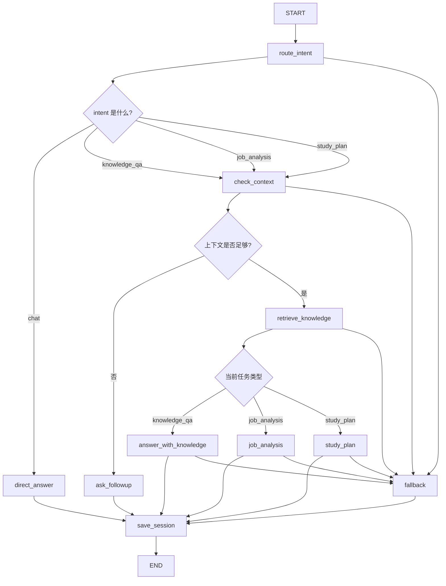

# JobStudyAgent 项目设计

## 1. 项目定位

### 1.1 项目名称

`JobStudyAgent`

### 1.2 项目一句话介绍

一个面向求职与学习场景的 AI Agent 项目，支持多轮对话、资料上传建库、知识库检索、岗位分析、学习建议和面试模拟。

### 1.3 为什么做这个项目

这个项目不是单纯做一个“聊天接口”，而是把前面学过的核心能力整合到一个真实业务场景里：

- Tool Calling
- Session Memory
- RAG
- LangChain
- LangGraph
- Routing
- Fallback

它适合写进简历，也适合面试时讲解，因为业务场景清楚、功能边界明确、技术点比较完整。

---

## 2. 项目目标

这个项目希望解决的问题是：

1. 用户可以上传岗位 JD、学习笔记、项目总结、面试题等资料
2. 系统可以把这些资料做成可检索知识库
3. 用户可以围绕这些资料进行多轮问答
4. 系统可以判断用户当前意图，而不是所有问题都走同一种处理逻辑
5. 当信息不足时，系统可以先追问，而不是盲目回答
6. 对于某些固定任务，系统可以按预设工作流分步完成

一句话概括：

**这个项目要体现的不是“模型能回答”，而是“系统会判断、会选择、会分步执行”。**

---

## 3. MVP 功能范围

### 3.1 第一版必须做的功能

第一版先做以下 5 个核心能力：

1. 资料上传建库
2. 知识库问答
3. 多轮会话记忆
4. 岗位分析
5. 学习建议生成

### 3.2 第一版建议对应的业务能力

#### 功能 1：上传资料建库

用户可以上传：

- 岗位 JD
- 学习笔记
- 项目总结
- 面试题

系统要完成：

1. 读取文本
2. 切分 chunk
3. 生成 embedding
4. 建立本地向量索引
5. 保存索引元数据

这个功能复用你第二章已经做过的 RAG 上传建库能力。

#### 功能 2：知识库问答

用户可以问：

- “这个岗位最看重什么能力？”
- “我上传的 FastAPI 笔记里是怎么解释路由的？”
- “这份资料里提到了哪些 Agent 相关知识点？”

系统要完成：

1. 判断是否需要检索知识库
2. 从指定或默认知识库中检索
3. 把检索结果拼入上下文
4. 生成回答

#### 功能 3：多轮会话记忆

用户可以连续追问：

- “这个岗位最看重什么能力？”
- “那我现在还缺什么？”
- “给我一个 7 天补强计划”

系统要完成：

1. 通过 `session_id` 区分会话
2. 保存历史消息
3. 下次请求恢复历史上下文
4. 在新问题中结合历史回答继续推理

#### 功能 4：岗位分析

用户可以问：

- “帮我分析这份 Java AI 应用开发岗位 JD”
- “这个岗位要求里，哪些是我最该优先补的？”

这个功能不只是普通问答，而是一个固定任务。

系统可以按工作流分步做：

1. 读取岗位资料
2. 提取技能要求
3. 按技术类别归类
4. 总结重点能力
5. 输出分析结果

#### 功能 5：学习建议生成

用户可以问：

- “结合这份岗位要求，给我一个 7 天学习计划”
- “我现在是 Java 后端，转 AI 应用开发应该先补什么？”

这个功能本质上也是一个工作流型任务。

系统可以：

1. 获取岗位重点
2. 结合用户背景
3. 输出阶段性学习建议
4. 给出可执行学习计划

---

## 4. 第一版暂时不做的内容

为了防止项目失控，第一版先不做：

- MySQL 持久化
- Redis 缓存
- 用户登录
- 多用户权限
- 前端页面
- 多 Agent 协作
- 定时任务
- 复杂观察链路

这些都可以后续扩展，但不是当前项目最核心的价值点。

---

## 5. 项目中的 Agent 能力拆解

这个项目里的 Agent，不是“一个万能聊天机器人”，而是一个会根据意图切换处理方式的系统。

我建议把第一版意图拆成 4 类：

### 5.1 `chat`

普通聊天或泛问题：

- “你是谁？”
- “什么是 FastAPI？”

处理方式：

- 直接让模型回答

### 5.2 `knowledge_qa`

面向知识库的问答：

- “我上传的资料中怎么讲 LangGraph？”
- “这份 JD 中提到了哪些要求？”

处理方式：

- 先检索，再回答

### 5.3 `job_analysis`

面向岗位分析的任务：

- “分析这份岗位 JD”
- “这个岗位最看重什么能力？”

处理方式：

- 走固定工作流

### 5.4 `study_plan`

面向学习建议和计划生成：

- “给我一个 7 天学习计划”
- “我应该先补哪些知识？”

处理方式：

- 走固定工作流

---

## 6. 接口设计建议

第一版接口建议不要太多，保持能演示主线即可。

### 6.1 资料上传建库

`POST /agent/upload-index`

作用：

- 上传资料并建立本地知识库索引

### 6.2 列出知识库

`GET /agent/indexes`

作用：

- 查看当前已有知识库

### 6.3 Agent 主入口

`POST /agent/chat`

作用：

- 综合入口
- 用户只需要发消息，系统自动判断意图、是否检索、是否追问、是否走工作流

### 6.4 可选调试接口

`POST /agent/chat/debug`

作用：

- 返回中间过程
- 方便学习和面试演示
- 可以看到 route、retrieval、tool_calls、final_reply 等中间数据

---

## 7. LangGraph 总体设计思路

### 7.1 为什么综合项目要用 LangGraph

因为这个项目已经不是一个单函数调用模型的 Demo 了，而是同时包含：

- 意图判断
- 缺参追问
- 检索
- 固定工作流
- 兜底
- 多轮记忆

这些逻辑如果继续全写在一个超长 `service` 函数里，会越来越难维护。

LangGraph 适合在这里承担“流程编排器”的角色。

### 7.2 图里建议有的核心节点

我建议第一版主图至少包含下面这些节点：

1. `route_intent`
2. `check_context`
3. `retrieve_knowledge`
4. `job_analysis`
5. `study_plan`
6. `direct_answer`
7. `fallback`

### 7.3 各节点职责

#### `route_intent`

作用：

- 判断用户当前问题属于哪一类

输出重点：

- `intent`

可能值：

- `chat`
- `knowledge_qa`
- `job_analysis`
- `study_plan`

#### `check_context`

作用：

- 检查当前问题是否具备足够上下文
- 例如：
  - 是否有可用知识库
  - 是否指定了 index
  - 是否上传过岗位资料
  - 是否缺少关键输入

如果信息不足：

- 直接生成追问回复
- 不进入后续节点

#### `retrieve_knowledge`

作用：

- 针对知识库问答或岗位分析类问题
- 检索相关 chunk
- 把检索结果写入 state

输出重点：

- `retrieved_chunks`
- `retrieved_sources`

#### `job_analysis`

作用：

- 基于知识库中的岗位资料
- 输出岗位技能要求、重点能力和建议关注方向

#### `study_plan`

作用：

- 基于用户背景和岗位要求
- 输出分阶段学习建议

#### `direct_answer`

作用：

- 对普通聊天问题直接回答
- 或对已经有足够上下文的问题生成最终回复

#### `fallback`

作用：

- 当路由失败、知识库为空、检索结果不足、模型解析失败时
- 返回清晰的兜底提示

---

## 8. LangGraph 整体流程图

下面这张图是第一版建议主流程：

---

## 9. 运行视角下的主链路

从运行顺序看，第一版综合项目的主链路可以理解成下面这几步：

1. 用户请求进入 `POST /agent/chat`
2. 后端根据 `session_id` 取出历史会话
3. 组装图初始 `state`
4. 进入 `route_intent`
5. 判断是普通聊天、知识库问答、岗位分析，还是学习计划
6. 如果需要知识库，就先做 `check_context`
7. 上下文足够时执行 `retrieve_knowledge`
8. 根据任务类型走不同回答节点
9. 如果中途异常或信息不足，就走 `fallback` 或 `ask_followup`
10. 最后保存会话历史并返回结果

---

## 10. 第一版 state 设计建议

为了方便后面编码，我建议先把图状态设计成统一结构。

可以先包含这些字段：

- `session_id`
- `message`
- `messages`
- `intent`
- `reply`
- `selected_index_name`
- `retrieved_chunks`
- `retrieved_sources`
- `need_followup`
- `followup_question`
- `error_message`
- `debug_steps`

### 10.1 每个字段的大致作用

`session_id`

- 当前会话 id

`message`

- 当前用户这一轮输入

`messages`

- 发给模型使用的完整消息链

`intent`

- 当前路由出来的任务类型

`reply`

- 最终要返回给用户的话

`selected_index_name`

- 当前使用的知识库名称

`retrieved_chunks`

- 检索到的知识片段

`retrieved_sources`

- 检索命中的来源文档名

`need_followup`

- 是否需要追问

`followup_question`

- 追问内容

`error_message`

- 失败时的错误信息

`debug_steps`

- 调试时记录每一步做了什么

---

## 11. 我们后面开发时的落地顺序

建议后面按这个顺序实现，不容易乱：

1. 搭项目骨架
2. 建 `agent` 模块
3. 定 `schema`
4. 定 LangGraph `state`
5. 先实现 `route_intent`
6. 再实现 `check_context`
7. 复用已有 RAG 能力接上 `retrieve_knowledge`
8. 实现 `answer_with_knowledge`
9. 实现 `job_analysis`
10. 实现 `study_plan`
11. 补 `save_session`
12. 最后补 `debug` 返回结构

---

## 12. 当前阶段结论

这个综合项目的第一版，不追求做成一个“大而全平台”，而是做成一个：

- 场景真实
- 结构清晰
- 技术点完整
- 面试可讲
- 能在当前学习阶段真正做完的 Agent 项目

一句话确定方向：

**我们接下来要做的是一个“面向求职与学习场景的 LangGraph 编排型知识库 Agent”。**

---

## 13. 当前实现进度对照

到目前为止，这个项目已经完成了第一版主线里的核心能力：

- FastAPI 项目骨架
- `.env` 配置与大模型调用
- 内存版会话记忆
- LangGraph 主流程编排
- 知识库上传建库
- 知识库列表查询
- 知识库片段检索
- 基于知识片段回答
- 岗位分析节点
- 学习计划节点
- debug 返回结构

当前主图实际已经包含这些节点：

- `route_intent`
- `check_context`
- `retrieve_knowledge`
- `answer_with_knowledge`
- `job_analysis`
- `study_plan`
- `direct_answer`
- `fallback`
- `save_session`

也就是说，这个项目现在已经从“设计方案”进入了“可以实际演示和讲解的第一版成品”。
